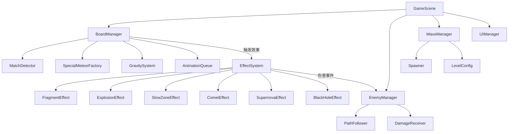
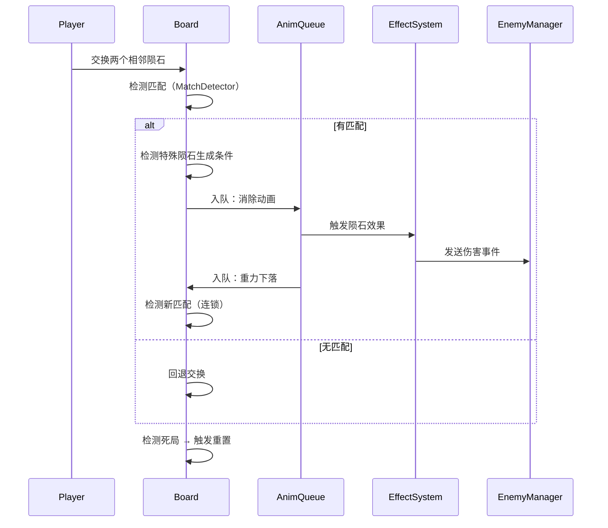

# 技术设计文档：三消塔防游戏（match3-tower-defense）

## 概述

本游戏是一款三消与塔防融合的策略游戏。玩家在网格棋盘上交换相邻陨石，通过消除同色连线触发各类攻击效果，阻止从右侧出怪口涌来的敌人到达左侧基地。

核心设计目标：
- 三消操作与塔防防御机制深度融合
- 消除效果逐步展开，动画流畅，连锁清晰
- 随机地图与波次系统保证每局体验不同
- 五种陨石类型 × 三种特殊陨石 × 四种敌人类型构成丰富的策略空间

技术选型建议：使用 **Phaser 3**（TypeScript）作为游戏引擎，利用其内置的 Tween 动画系统、物理引擎和场景管理能力。

---

## 架构

### 整体架构



### 核心循环



### 动画队列机制

所有视觉效果通过 `AnimationQueue`（异步队列）串行或分组执行，确保需求 1.3 / 15.1 的"逐步展开"要求：

```
AnimationQueue
  ├── Step 1: 消除动画（同组陨石并行播放）
  ├── Step 2: 特殊陨石激活动画
  ├── Step 3: 效果动画（碎片/爆炸/减速区域）
  ├── Step 4: 重力下落动画
  └── Step 5: 新陨石填充动画
```

---

## 组件与接口

### BoardManager

负责棋盘状态管理、交换检测、消除流程调度。

```typescript
interface BoardManager {
  // 初始化棋盘（地图生成后调用）
  initialize(map: MapData): void;

  // 玩家触发交换
  swapMeteors(posA: GridPos, posB: GridPos): void;

  // 检测所有匹配组
  detectMatches(): MatchGroup[];

  // 执行消除流程（含动画队列调度）
  processMatches(matches: MatchGroup[]): Promise<void>;

  // 重力下落填充
  applyGravity(): Promise<void>;

  // 检测死局
  hasValidMoves(): boolean;

  // 触发重置流程
  triggerReset(): Promise<void>;
}
```

### MatchDetector

```typescript
interface MatchGroup {
  cells: GridPos[];
  color: MeteorColor;
  specialType: SpecialMeteorType | null; // 检测到的特殊陨石类型
  specialPos: GridPos | null;            // 特殊陨石生成位置
}

interface MatchDetector {
  // 扫描整个棋盘，返回所有匹配组
  scan(board: Cell[][]): MatchGroup[];

  // 判断特殊陨石生成类型（优先级：BlackHole > Supernova > Comet）
  detectSpecialType(group: MatchGroup): SpecialMeteorType | null;
}
```

### SpecialMeteorFactory

```typescript
interface SpecialMeteorFactory {
  create(type: SpecialMeteorType, pos: GridPos, color: MeteorColor): SpecialMeteor;
}

interface SpecialMeteor {
  type: SpecialMeteorType;
  pos: GridPos;
  color: MeteorColor;
  // 激活效果（返回受影响的格子列表）
  activate(board: Cell[][], interactTarget?: SpecialMeteor): ActivationResult;
}
```

### EffectSystem

```typescript
interface EffectSystem {
  // 触发陨石消除效果
  triggerMeteorEffect(meteor: Meteor, pos: GridPos): void;

  // 触发红色陨石下落伤害（下落过程中持续检测）
  triggerFallingDamage(pos: GridPos, targetPos: GridPos): void;

  // 触发碎片（绿色/蓝色）
  spawnFragments(pos: GridPos, directions: Direction[]): Fragment[];

  // 触发爆炸（黄色）
  triggerExplosion(pos: GridPos, radius: number): void;

  // 创建减速区域（紫色）
  createSlowZone(pos: GridPos, radius: number, duration: number): SlowZone;

  // 触发彗星路径伤害
  triggerCometLineDamage(cells: GridPos[]): void;
}
```

### EnemyManager

```typescript
interface EnemyManager {
  // 获取指定格子范围内的所有敌人
  getEnemiesInArea(center: WorldPos, radius: number): Enemy[];

  // 获取路径上的敌人（用于碎片/彗星）
  getEnemiesOnPath(path: WorldPos[]): Enemy[];

  // 对敌人造成伤害
  dealDamage(enemy: Enemy, amount: number): void;

  // 应用减速效果
  applySlowEffect(enemy: Enemy, zone: SlowZone): void;
}
```

### WaveManager

```typescript
interface WaveManager {
  totalWaves: number;       // 10~15 随机
  currentWave: number;

  // 开始下一波
  startNextWave(): void;

  // 当前波次是否结束
  isWaveComplete(): boolean;

  // 生成波次配置（难度递增）
  generateWaveConfig(waveIndex: number): WaveConfig;
}

interface WaveConfig {
  enemies: EnemySpawnEntry[];
  spawnInterval: number;    // 出怪间隔（毫秒）
}

interface EnemySpawnEntry {
  type: EnemyType;
  count: number;
  delay: number;            // 相对波次开始的延迟
}
```

### MapGenerator

```typescript
interface MapGenerator {
  // 生成地图（宽高各自在 16~20 随机）
  generate(): MapData;
}

interface MapData {
  width: number;            // 16~20
  height: number;           // 16~20
  cells: CellType[][];      // PATH | NON_PATH
  path: GridPos[];          // 从出怪口到基地的有序路径
  spawnerPos: GridPos;      // 最右侧
  basePos: GridPos;         // 最左侧
}
```

---

## 数据模型

### 枚举类型

```typescript
enum MeteorColor {
  RED = 'A',
  GREEN = 'B',
  BLUE = 'C',
  YELLOW = 'D',
  PURPLE = 'E',
}

enum SpecialMeteorType {
  COMET = 'COMET',
  SUPERNOVA = 'SUPERNOVA',
  BLACK_HOLE = 'BLACK_HOLE',
}

enum EnemyType {
  NORMAL = 'NORMAL',
  QUICK = 'QUICK',
  BREAK = 'BREAK',
  SLOW = 'SLOW',
}

enum CellType {
  PATH = 'PATH',
  NON_PATH = 'NON_PATH',
}

enum Direction {
  UP, DOWN, LEFT, RIGHT,
  UP_LEFT, UP_RIGHT, DOWN_LEFT, DOWN_RIGHT,
}
```

### 核心数据结构

```typescript
interface GridPos {
  col: number;
  row: number;
}

interface WorldPos {
  x: number;
  y: number;
}

interface Cell {
  type: CellType;
  meteor: Meteor | null;
}

interface Meteor {
  color: MeteorColor;
  specialType: SpecialMeteorType | null;
  // 是否为分裂出的 Enemy_Normal（不再分裂标记）
  isSplitSpawn?: boolean;
}

interface Fragment {
  pos: WorldPos;
  direction: Direction;
  speed: number;
  damage: number;
  active: boolean;
}

interface SlowZone {
  center: WorldPos;
  radius: number;           // 2格
  slowFactor: number;       // 速度倍率 0.4（降至原速度的40%）
  dotDamagePerSecond: number; // 每秒持续伤害 1.0
  remainingTime: number;    // 初始 4000ms
  active: boolean;
}

interface Enemy {
  type: EnemyType;
  hp: number;
  maxHp: number;
  speed: number;            // 格/秒
  baseDamage: number;       // 到达基地时的伤害
  pathIndex: number;        // 当前路径节点索引
  worldPos: WorldPos;
  isSplitSpawn: boolean;    // Enemy_Break 分裂出的标记
  activeSlowZones: SlowZone[];
}

interface Base {
  hp: number;               // 初始 20
  maxHp: number;
}
```

### 敌人基础属性配置

| 类型 | HP | 速度（格/秒） | 基地伤害 | 特殊行为 |
|------|-----|------------|---------|---------|
| NORMAL | 10 | 2.0 | 1 | 无 |
| QUICK | 5 | 4.0 | 1 | 无 |
| BREAK | 20 | 2.5 | 2 | 死亡时分裂出 2 个 NORMAL |
| SLOW | 40 | 0.8 | 5 | 无 |

### 特殊陨石生成条件

| 类型 | 生成条件 | 优先级 |
|------|---------|-------|
| BlackHole | 单行/列 ≥5 个同色 | 1（最高） |
| Supernova | 十字形5连（中心+上下左右各1同色） | 2 |
| Comet | 单行/列 恰好4个同色 | 3（最低） |

### 特殊陨石交互矩阵

| 激活方 \ 目标 | 普通陨石 | Comet | Supernova | BlackHole |
|-------------|---------|-------|-----------|-----------|
| Comet | 消除整行/列 | 3行3列消除 | 3行3列消除 | 消除整行/列 |
| Supernova | 爆炸伤害 | 3行3列消除 | 爆炸伤害 | 爆炸伤害 |
| BlackHole | 消除所有同色 | 同色→Comet再消除 | 同色→Supernova再消除 | 清除全部陨石 |

### 效果伤害数值配置

| 效果类型 | 伤害值 | 备注 |
|---------|-------|------|
| 红色陨石下落 | 1 | 与碎片伤害相同，下落路径上每个敌人各受1次 |
| 绿色/蓝色碎片 | 1 | 每个碎片命中一次，穿透（可命中多个敌人） |
| 黄色爆炸 | 3 | 范围内所有敌人各受1次 |
| 彗星路径 | 2 | 消除路径上每个敌人各受1次 |
| 紫色减速区域 DoT | 1.0/秒 | 持续4秒，区域内敌人每秒受1点伤害 |

### 路径生成算法（随机游走）

`MapGenerator` 使用随机游走（Random Walk）算法生成从出怪口到基地的路径：

```
1. 起点：最右列随机一行（spawnerPos）
2. 终点：最左列随机一行（basePos）
3. 游走规则：
   - 当前位置优先向左移动（权重 60%），其次上/下（各 20%）
   - 不允许向右移动（防止路径回头）
   - 不允许走出棋盘边界
   - 不允许与已有路径重叠（防止自交）
4. 终止条件：到达最左列任意行后，直线连接至 basePos
5. 后处理：
   - 验证非道路格数量 > 总格子数 50%，否则重新生成
   - 验证存在至少一个 3×3 连续非道路区域，否则重新生成
   - 最大重试次数：10 次，超出则放宽约束重新生成
```

---

## 正确性属性

*属性（Property）是在系统所有合法执行路径上都应成立的特征或行为——本质上是对系统应做什么的形式化陈述。属性是人类可读规范与机器可验证正确性保证之间的桥梁。*

### 棋盘属性

1. **无悬空陨石**：任意消除并执行重力后，所有非道路格要么有陨石，要么其下方存在道路格或棋盘边界——不存在"上有陨石、下有空格"的情况。

2. **陨石颜色分布**：棋盘初始化后，每种颜色的陨石数量占非道路格总数的比例在 10%~30% 之间（防止某色过多或过少）。

3. **死局检测完备性**：`hasValidMoves()` 返回 `false` 当且仅当棋盘上不存在任何一次交换能产生 3 个及以上同色连线。

4. **重置后无死局**：`triggerReset()` 执行完毕后，`hasValidMoves()` 必须返回 `true`。

### 消除与特殊陨石属性

5. **特殊陨石唯一性**：同一次消除操作最多生成一个特殊陨石。

6. **特殊陨石优先级**：若同一消除组同时满足黑洞、超新星、彗星的生成条件，生成的特殊陨石类型必须为黑洞。

7. **消除完整性**：一次消除流程结束后，棋盘上不存在任何满足消除条件（3个及以上同色连线）的普通陨石组合（连锁已全部处理完毕）。

### 敌人与伤害属性

8. **伤害非负**：任何效果对敌人造成的伤害值 ≥ 0，敌人 HP 不会降至负数（最低为 0）。

9. **Enemy_Break 分裂唯一性**：`isSplitSpawn = true` 的 Enemy_Normal 被消灭时，不会再次分裂出新的敌人。

10. **减速区域叠加上限**：同一敌人同时处于多个减速区域时，速度倍率取所有区域中最低值（不叠乘），但 DoT 伤害叠加计算。

### 波次与关卡属性

11. **波次难度单调性**：第 N+1 波的总敌人威胁值（HP × 基地伤害的加权和）不低于第 N 波。

12. **关卡血量继承**：新关卡开始时，基地 HP 等于上一关结束时的基地 HP，不重置。

13. **地图连通性**：生成的地图中，从 spawnerPos 到 basePos 必须存在且仅存在一条有效路径。
